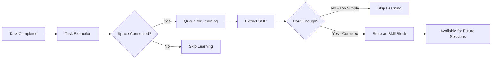

<div align="center">
  <a href="https://discord.acontext.io">
      
  </a>
  <p>
    <h3>Almacenar Contextos, Aprender Habilidades</h3>
  </p>
  <p align="center">
    <a href="https://pypi.org/project/acontext/"></a>
    <a href="https://www.npmjs.com/package/@acontext/acontext"></a>
    <a href="https://github.com/memodb-io/acontext/actions/workflows/core-test.yaml"></a>
    <a href="https://github.com/memodb-io/acontext/actions/workflows/api-test.yaml"></a>
    <a href="https://github.com/memodb-io/acontext/actions/workflows/cli-test.yaml"></a>
  </p>
  <p align="center">
    <a href="https://x.com/acontext_io"></a>
    <a href="https://discord.acontext.io"></a>
  </p>
  <div align="center">
    <!-- Keep these links. Translations will automatically update with the README. -->
    <a href="../../readme/de/README.md">Deutsch</a> | 
    <a href="../../readme/es/README.md">Español</a> | 
    <a href="../../readme/fr/README.md">Français</a> | 
    <a href="../../readme/ja/README.md">日本語</a> | 
    <a href="../../readme/ko/README.md">한국어</a> | 
    <a href="../../readme/pt/README.md">Português</a> | 
    <a href="../../readme/ru/README.md">Русский</a> | 
    <a href="../../readme/zh/README.md">中文</a>
  </div>
  <br/>
</div>


Acontext es una **plataforma de datos de contexto** para aplicaciones de AI Agent **cloud-native**. Puede:

- **Almacenar** contextos y artifacts
- **Observar** tareas de agentes y retroalimentación del usuario.
- Habilitar el **autoaprendizaje** de agentes mediante la destilación de habilidades de las tareas completadas del agente.
- Ver cada contexto en un **Dashboard**.


<div align="center">
    <picture>
      
    </picture>
  <p>Almacenar, Observar y Aprender</p>
</div>


Lo estamos construyendo porque creemos que Acontext puede ayudarte a:

- **Construir un producto de agente más escalable con mejor ingeniería de contexto**
- **Mejorar la tasa de éxito de tu agente y reducir los pasos de ejecución**

para que tu agente pueda ser más estable y brindar mayor valor a tus usuarios.


# 💡 Conceptos Centrales

- [**Session**](https://docs.acontext.io/store/messages/multi-provider) - Puedes almacenar contexto en Acontext, como una base de datos pero solo usada para contexto.
  - [**Task Agent**](https://docs.acontext.io/observe/agent_tasks) - Agente TODO en segundo plano que recopila el estado, progreso y preferencias de la tarea.
- [**Disk**](https://docs.acontext.io/store/disk) - Almacenamiento de archivos para artifacts de agentes.
- [**Space**](https://docs.acontext.io/learn/skill-space) - Un `Space` similar a Notion para agentes, donde se almacenan las habilidades aprendidas. 
  - [**Experience Agent**](https://docs.acontext.io/learn/advance/experience-agent) - Agentes en segundo plano que destilan, guardan y buscan habilidades.

### Cómo Trabajan Juntos

```txt
┌──────┐    ┌────────────┐    ┌──────────────┐    ┌───────────────┐
│ User │◄──►│ Your Agent │◄──►│   Session    │    │ Artifact Disk │
└──────┘    └─────▲──────┘    └──────┬───────┘    └───────────────┘
                  │                  │
                  │         ┌────────▼────────┐
                  │         │ Observed Tasks  │
                  │         └────────┬────────┘
                  │                  │
                  │         ┌────────▼────────┐
                  │         │   Learn Skills  │ # or wait for user confirmation
                  │         └────────┬────────┘
                  │                  │
                  └──────────────────┘
                  Las habilidades guían al agente
```


<details>
<summary>📖 Task Structure</summary>

```json
{
  "task_description": "Star https://github.com/memodb-io/Acontext",
  "progresses": [
    "I have navigated to Acontext repo",
    "Tried to Star but a pop-up required me to login",
    ...
  ],
  "user_preferences": [
    "user wants to use outlook email to login"
  ]
}
```
</details>


<details>
<summary>📖 Skill Structure</summary>


```json
{
    "use_when": "star a repo on github.com",
    "preferences": "use user's outlook account",
    "tool_sops": [
        {"tool_name": "goto", "action": "goto github.com"},
        {"tool_name": "click", "action": "find login button if any. login first"},
        ...
    ]
}
```

</details>


<details>
<summary>📖 Space Structure</summary>

```txt
/
└── github/ (folder)
    └── GTM (page)
        ├── find_trending_repos (sop)
        └── find_contributor_emails (sop)
    └── basic_ops (page)
        ├── create_repo (sop)
        └── delete_repo (sop)
    ...
```
</details>


# 🚀 Start the Backend Locally

Tenemos un `acontext-cli` para ayudarte a hacer una prueba de concepto rápida. Descárgalo primero en tu terminal:

```bash
curl -fsSL https://install.acontext.io | sh
```

Deberías tener [docker](https://www.docker.com/get-started/) instalado y una Clave API de OpenAI para iniciar un backend de Acontext en tu computadora:

```bash
mkdir acontext_server && cd acontext_server
acontext docker up
```

> [📖 configuración local](https://docs.acontext.io/local#start-acontext-server-locally) Acontext requiere al menos una Clave API de OpenAI. Recomendamos `gpt-5.1` o `gpt-4.1` como modelo LLM

`acontext docker up` creará/usará `.env` y `config.yaml` para Acontext, y creará una carpeta `db` para persistir datos.


Una vez completado, puedes acceder a los siguientes endpoints:

- Acontext API Base URL: http://localhost:8029/api/v1
- Acontext Dashboard: http://localhost:3000/


<div align="center">
    <picture>
      
    </picture>
  <p>Dashboard de Tasa de Éxito y otras Métricas</p>
</div>


# 🧐 Use Acontext to build Agent

Descarga scripts de extremo a extremo con `acontext`:

**Python**

```bash
acontext create my-proj --template-path "python/openai-basic"
```

> Más ejemplos en Python:
>
> - `python/openai-agent-basic`: Agent de autoaprendizaje en openai agent sdk.
> - `python/agno-basic`: Agent de autoaprendizaje en agno framework.
> - `python/openai-agent-artifacts`: Agent que puede editar y descargar Artifacts.

**Typescript**

```bash
acontext create my-proj --template-path "typescript/openai-basic"
```

> Más ejemplos en Typescript:
>
> - `typescript/vercel-ai-basic`: Agent de autoaprendizaje en @vercel/ai-sdk


Consulta nuestro repositorio de ejemplos para más plantillas: [Acontext-Examples](https://github.com/memodb-io/Acontext-Examples).


## SDK Walk-through

<details>
<summary>Haz clic para abrir</summary>


Mantenemos SDKs de Python [](https://pypi.org/project/acontext/) y Typescript [](https://www.npmjs.com/package/@acontext/acontext). Los fragmentos de código a continuación usan Python.

## Instalar SDKs

```
pip install acontext # for Python
npm i @acontext/acontext # for Typescript
```


## Inicializar Cliente

```python
from acontext import AcontextClient

client = AcontextClient(
    base_url="http://localhost:8029/api/v1",
    api_key="sk-ac-your-root-api-bearer-token"
)
client.ping()

# yes, the default api_key is sk-ac-your-root-api-bearer-token
```

> [📖 async client doc](https://docs.acontext.io/settings/core)


## Almacenar

Acontext puede gestionar sesiones de Agents y Artifacts.

### Guardar Mensajes [📖](https://docs.acontext.io/api-reference/session/send-message-to-session)

Acontext ofrece almacenamiento persistente para datos de mensajes. Cuando llamas a `session.send_message`, Acontext persistirá el mensaje y comenzará a monitorear esta sesión:

<details>
<summary>Fragmento de Código</summary>

```python
session = client.sessions.create()

messages = [
    {"role": "user", "content": "I need to write a landing page of iPhone 15 pro max"},
    {
        "role": "assistant",
        "content": "Sure, my plan is below:\n1. Search for the latest news about iPhone 15 pro max\n2. Init Next.js project for the landing page\n3. Deploy the landing page to the website",
    }
]

# Save messages
for msg in messages:
    client.sessions.send_message(session_id=session.id, blob=msg, format="openai")
```

> [📖](https://docs.acontext.io/store/messages/multi-modal) También admitimos almacenamiento de mensajes multi-modal y SDK de anthropic.


</details>

### Cargar Mensajes [📖](https://docs.acontext.io/api-reference/session/get-messages-from-session)

Obtén los mensajes de tu sesión usando `sessions.get_messages`

<details>
<summary>Fragmento de Código</summary>

```python
r = client.sessions.get_messages(session.id)
new_msg = r.items

new_msg.append({"role": "user", "content": "How are you doing?"})
r = openai_client.chat.completions.create(model="gpt-4.1", messages=new_msg)
print(r.choices[0].message.content)
client.sessions.send_message(session_id=session.id, blob=r.choices[0].message)
```

</details>

<div align="center">
    <picture>
      
    </picture>
  <p>Puedes ver sesiones en tu Dashboard local</p>
</div>


### Artifacts [📖](https://docs.acontext.io/store/disk)

Crea un disco para tu Agent para almacenar y leer Artifacts usando rutas de archivos:

<details>
<summary>Fragmento de Código</summary>

```python
from acontext import FileUpload

disk = client.disks.create()

file = FileUpload(
    filename="todo.md",
    content=b"# Sprint Plan\n\n## Goals\n- Complete user authentication\n- Fix critical bugs"
)
artifact = client.disks.artifacts.upsert(
    disk.id,
    file=file,
    file_path="/todo/"
)


print(client.disks.artifacts.list(
    disk.id,
    path="/todo/"
))

result = client.disks.artifacts.get(
    disk.id,
    file_path="/todo/",
    filename="todo.md",
    with_public_url=True,
    with_content=True
)
print(f"✓ File content: {result.content.raw}")
print(f"✓ Download URL: {result.public_url}")        
```
</details>


<div align="center">
    <picture>
      
    </picture>
  <p>Puedes ver Artifacts en tu Dashboard local</p>
</div>


## Observar [📖](https://docs.acontext.io/observe)

Para cada sesión, Acontext **automáticamente** lanzará un Agent en segundo plano para rastrear el progreso de la tarea y la retroalimentación del usuario. **Es como un Agent TODO en segundo plano**. Acontext lo usará para observar tu tasa de éxito diaria del Agent.

Puedes usar el SDK para recuperar el estado actual de la sesión del Agent, para Context Engineering como Reducción y Compresión. 

<details>
<summary>Script Completo</summary>

```python
from acontext import AcontextClient

# Initialize client
client = AcontextClient(
    base_url="http://localhost:8029/api/v1", api_key="sk-ac-your-root-api-bearer-token"
)

# Create a project and session
session = client.sessions.create()

# Conversation messages
messages = [
    {"role": "user", "content": "I need to write a landing page of iPhone 15 pro max"},
    {
        "role": "assistant",
        "content": "Sure, my plan is below:\n1. Search for the latest news about iPhone 15 pro max\n2. Init Next.js project for the landing page\n3. Deploy the landing page to the website",
    },
    {
        "role": "user",
        "content": "That sounds good. Let's first collect the message and report to me before any landing page coding.",
    },
    {
        "role": "assistant",
        "content": "Sure, I will first collect the message then report to you before any landing page coding.",
      	"tool_calls": [
            {
                "id": "call_001",
                "type": "function",
                "function": {
                    "name": "search_news",
                    "arguments": "{\"query\": \"iPhone news\"}"
                }
            }
        ]
    },
]

# Send messages in a loop
for msg in messages:
    client.sessions.send_message(session_id=session.id, blob=msg, format="openai")

# Wait for task extraction to complete
client.sessions.flush(session.id)

# Display extracted tasks
tasks_response = client.sessions.get_tasks(session.id)
print(tasks_response)
for task in tasks_response.items:
    print(f"\nTask #{task.order}:")
    print(f"  ID: {task.id}")
    print(f"  Title: {task.data['task_description']}")
    print(f"  Status: {task.status}")

    # Show progress updates if available
    if "progresses" in task.data:
        print(f"  Progress updates: {len(task.data['progresses'])}")
        for progress in task.data["progresses"]:
            print(f"    - {progress}")

    # Show user preferences if available
    if "user_preferences" in task.data:
        print("  User preferences:")
        for pref in task.data["user_preferences"]:
            print(f"    - {pref}")

```
> `flush` es una llamada bloqueante, esperará a que se complete la extracción de tareas.
> No necesitas llamarlo en producción, Acontext tiene un mecanismo de buffer para asegurar que la extracción de tareas se complete en el momento adecuado.

</details>

Ejemplo de Retorno de Tarea:

```txt
Task #1:
  Title: Search for the latest news about iPhone 15 Pro Max and report findings to the user before any landing page coding.
  Status: success
  Progress updates: 2
    - I confirmed that the first step will be reporting before moving on to landing page development.
    - I have already collected all the iPhone 15 pro max info and reported to the user, waiting for approval for next step.
  User preferences:
    - user expects a report on latest news about iPhone 15 pro max before any coding work on the landing page.

Task #2:
  Title: Initialize a Next.js project for the iPhone 15 Pro Max landing page.
  Status: pending

Task #3:
  Title: Deploy the completed landing page to the website.
  Status: pending
```


Puedes ver los estados de las tareas de sesión en el Dashboard:

<div align="center">
    <picture>
      
    </picture>
  <p>Una Demostración de Tarea</p>
</div>


## Autoaprendizaje

Acontext puede recopilar un montón de sesiones y aprender habilidades (SOPs) sobre cómo llamar herramientas para ciertas tareas.

### Aprender Habilidades a un `Space` [📖](https://docs.acontext.io/learn/skill-space)

Un `Space` puede almacenar habilidades, experiencias y recuerdos en un sistema similar a Notion. Primero necesitas conectar una sesión a `Space` para habilitar el proceso de aprendizaje:

```python
# Step 1: Create a Space for skill learning
space = client.spaces.create()
print(f"Created Space: {space.id}")

# Step 2: Create a session attached to the space
session = client.sessions.create(space_id=space.id)

# ... push the agent working context
```

El aprendizaje ocurre en segundo plano y no es en tiempo real (retraso alrededor de 10-30 segundos). 

Lo que Acontext hará en segundo plano:



Finalmente, los bloques SOP con patrón de llamada de herramienta se guardarán en `Space`. Puedes ver cada `Space` en el Dashboard:

<div align="center">
    <picture>
      
    </picture>
  <p>Una Demostración de Space</p>
</div>


### Buscar Habilidades desde un `Space` [📖](https://docs.acontext.io/learn/search-skills)

Para buscar habilidades desde un `Space` y usarlas en la próxima sesión:

```python
result = client.spaces.experience_search(
    space_id=space.id,
    query="I need to implement authentication",
  	mode="fast"
)
```

Acontext admite modos `fast` y `agentic` para la búsqueda. El primero usa embeddings para coincidir habilidades. El segundo usa un Experience Agent para explorar todo el `Space` e intenta cubrir cada habilidad necesaria.

El retorno es una lista de bloques sop, que se ven así:

```json
{
    "use_when": "star a github repo",
    "preferences": "use personal account. star but not fork",
    "tool_sops": [
        {"tool_name": "goto", "action": "goto the user given github repo url"},
        {"tool_name": "click", "action": "find login button if any, and start to login first"},
        ...
    ]
}
```

</details>


# 🔍 Documentación

Para entender mejor lo que Acontext puede hacer, por favor consulta [nuestra documentación](https://docs.acontext.io/)


# ❤️ Mantente Actualizado

Marca Acontext con una estrella en Github para apoyar y recibir notificaciones instantáneas 


# 🤝 Mantente Conectado

Únete a la comunidad para obtener apoyo y discusiones:

-   [Discute con Constructores en Acontext Discord](https://discord.acontext.io) 👻 
-  [Sigue a Acontext en X](https://x.com/acontext_io) 𝕏 


# 🌟 Contribuir

- Revisa primero nuestro [roadmap.md](../../ROADMAP.md).
- Lee [contributing.md](../../CONTRIBUTING.md)


# 📑 LICENCIA

Este proyecto está actualmente licenciado bajo [Apache License 2.0](LICENSE).


# 🥇 Insignias

 

```md
[](https://acontext.io)

[](https://acontext.io)
```

