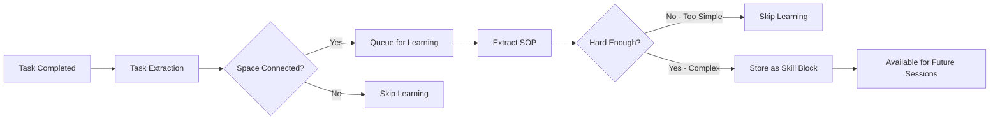

<div align="center">
  <a href="https://discord.acontext.io">
      
  </a>
  <p>
    <h3>コンテキストを保存、スキルを学習</h3>
  </p>
  <p align="center">
    <a href="https://pypi.org/project/acontext/"></a>
    <a href="https://www.npmjs.com/package/@acontext/acontext"></a>
    <a href="https://github.com/memodb-io/acontext/actions/workflows/core-test.yaml"></a>
    <a href="https://github.com/memodb-io/acontext/actions/workflows/api-test.yaml"></a>
    <a href="https://github.com/memodb-io/acontext/actions/workflows/cli-test.yaml"></a>
  </p>
  <p align="center">
    <a href="https://x.com/acontext_io"></a>
    <a href="https://discord.acontext.io"></a>
  </p>
  <div align="center">
    <!-- Keep these links. Translations will automatically update with the README. -->
    <a href="../../readme/de/README.md">Deutsch</a> | 
    <a href="../../readme/es/README.md">Español</a> | 
    <a href="../../readme/fr/README.md">Français</a> | 
    <a href="../../readme/ja/README.md">日本語</a> | 
    <a href="../../readme/ko/README.md">한국어</a> | 
    <a href="../../readme/pt/README.md">Português</a> | 
    <a href="../../readme/ru/README.md">Русский</a> | 
    <a href="../../readme/zh/README.md">中文</a>
  </div>
  <br/>
</div>


Acontextは、**クラウドネイティブ** AI Agentアプリケーション向けの**コンテキストデータプラットフォーム**です。以下のことができます：

- **保存** コンテキストとartifacts
- **観察** Agentタスクとユーザーフィードバック。
- Agentの完了したタスクからスキルを蒸留することで、Agentの**自己学習**を可能にします。
- すべてのコンテキストを1つの**ダッシュボード**で表示。


<div align="center">
    <picture>
      
    </picture>
  <p>保存、観察、学習</p>
</div>


私たちがこれを構築している理由は、Acontextが以下を支援できると信じているからです：

- **より良いコンテキストエンジニアリングで、よりスケーラブルなAgent製品を構築する**
- **Agentの成功率を向上させ、実行ステップを削減する**

これにより、Agentがより安定し、ユーザーに大きな価値を提供できるようになります。


# 💡 コアコンセプト

- [**Session**](https://docs.acontext.io/store/messages/multi-provider) - Acontextにコンテキストを保存できます。データベースのように、コンテキスト専用に使用されます。
  - [**Task Agent**](https://docs.acontext.io/observe/agent_tasks) - タスクのステータス、進捗、好みを収集するバックグラウンドTODO Agent。
- [**Disk**](https://docs.acontext.io/store/disk) - Agent Artifacts用のファイルストレージ。
- [**Space**](https://docs.acontext.io/learn/skill-space) - 学習したスキルが保存される、Notionのような Agents 用の`Space`。 
  - [**Experience Agent**](https://docs.acontext.io/learn/advance/experience-agent) - スキルを蒸留、保存、検索するバックグラウンド Agents。

### 連携の仕組み

```txt
┌──────┐    ┌────────────┐    ┌──────────────┐    ┌───────────────┐
│ User │◄──►│ Your Agent │◄──►│   Session    │    │ Artifact Disk │
└──────┘    └─────▲──────┘    └──────┬───────┘    └───────────────┘
                  │                  │
                  │         ┌────────▼────────┐
                  │         │ Observed Tasks  │
                  │         └────────┬────────┘
                  │                  │
                  │         ┌────────▼────────┐
                  │         │   Learn Skills  │ # or wait for user confirmation
                  │         └────────┬────────┘
                  │                  │
                  └──────────────────┘
                  スキルがAgentをガイド
```


<details>
<summary>📖 Task Structure</summary>

```json
{
  "task_description": "Star https://github.com/memodb-io/Acontext",
  "progresses": [
    "I have navigated to Acontext repo",
    "Tried to Star but a pop-up required me to login",
    ...
  ],
  "user_preferences": [
    "user wants to use outlook email to login"
  ]
}
```
</details>


<details>
<summary>📖 Skill Structure</summary>


```json
{
    "use_when": "star a repo on github.com",
    "preferences": "use user's outlook account",
    "tool_sops": [
        {"tool_name": "goto", "action": "goto github.com"},
        {"tool_name": "click", "action": "find login button if any. login first"},
        ...
    ]
}
```

</details>


<details>
<summary>📖 Space Structure</summary>

```txt
/
└── github/ (folder)
    └── GTM (page)
        ├── find_trending_repos (sop)
        └── find_contributor_emails (sop)
    └── basic_ops (page)
        ├── create_repo (sop)
        └── delete_repo (sop)
    ...
```
</details>


# 🚀 Start the Backend Locally

概念実証を迅速に行うために、`acontext-cli`を用意しています。まず、ターミナルでダウンロードしてください：

```bash
curl -fsSL https://install.acontext.io | sh
```

コンピューターでAcontextバックエンドを起動するには、[docker](https://www.docker.com/get-started/)がインストールされ、OpenAI APIキーが必要です：

```bash
mkdir acontext_server && cd acontext_server
acontext docker up
```

> [📖 ローカル設定](https://docs.acontext.io/local#start-acontext-server-locally) Acontextには少なくともOpenAI APIキーが必要です。LLMモデルとして`gpt-5.1`または`gpt-4.1`を推奨します

`acontext docker up`は、Acontext用の`.env`と`config.yaml`を作成/使用し、データを永続化するための`db`フォルダを作成します。


完了したら、次のエンドポイントにアクセスできます：

- Acontext API Base URL: http://localhost:8029/api/v1
- Acontext Dashboard: http://localhost:3000/


<div align="center">
    <picture>
      
    </picture>
  <p>成功率とその他のメトリクスのダッシュボード</p>
</div>


# 🧐 Use Acontext to build Agent

`acontext`でエンドツーエンドスクリプトをダウンロード：

**Python**

```bash
acontext create my-proj --template-path "python/openai-basic"
```

> Pythonのその他の例：
>
> - `python/openai-agent-basic`: openai agent sdkの自己学習 Agent。
> - `python/agno-basic`: agno frameworkの自己学習 Agent。
> - `python/openai-agent-artifacts`: Artifacts を編集およびダウンロードできる Agent。

**Typescript**

```bash
acontext create my-proj --template-path "typescript/openai-basic"
```

> Typescriptのその他の例：
>
> - `typescript/vercel-ai-basic`: @vercel/ai-sdkの自己学習 Agent


より多くのテンプレートについては、サンプルリポジトリを確認してください：[Acontext-Examples](https://github.com/memodb-io/Acontext-Examples)。


## SDK Walk-through

<details>
<summary>クリックして開く</summary>


Python [](https://pypi.org/project/acontext/) とTypescript [](https://www.npmjs.com/package/@acontext/acontext) SDKをメンテナンスしています。以下のコードスニペットはPythonを使用しています。

## SDKのインストール

```
pip install acontext # for Python
npm i @acontext/acontext # for Typescript
```


## クライアントの初期化

```python
from acontext import AcontextClient

client = AcontextClient(
    base_url="http://localhost:8029/api/v1",
    api_key="sk-ac-your-root-api-bearer-token"
)
client.ping()

# yes, the default api_key is sk-ac-your-root-api-bearer-token
```

> [📖 async client doc](https://docs.acontext.io/settings/core)


## 保存

Acontextは Agent セッションと Artifacts を管理できます.

### メッセージの保存 [📖](https://docs.acontext.io/api-reference/session/send-message-to-session)

Acontextはメッセージデータの永続ストレージを提供します。`session.send_message`を呼び出すと、Acontextはメッセージを永続化し、このセッションの監視を開始します：

<details>
<summary>コードスニペット</summary>

```python
session = client.sessions.create()

messages = [
    {"role": "user", "content": "I need to write a landing page of iPhone 15 pro max"},
    {
        "role": "assistant",
        "content": "Sure, my plan is below:\n1. Search for the latest news about iPhone 15 pro max\n2. Init Next.js project for the landing page\n3. Deploy the landing page to the website",
    }
]

# Save messages
for msg in messages:
    client.sessions.send_message(session_id=session.id, blob=msg, format="openai")
```

> [📖](https://docs.acontext.io/store/messages/multi-modal) マルチモーダルメッセージストレージとanthropic SDKもサポートしています。


</details>

### メッセージの読み込み [📖](https://docs.acontext.io/api-reference/session/get-messages-from-session)

`sessions.get_messages`を使用してセッションメッセージを取得

<details>
<summary>コードスニペット</summary>

```python
r = client.sessions.get_messages(session.id)
new_msg = r.items

new_msg.append({"role": "user", "content": "How are you doing?"})
r = openai_client.chat.completions.create(model="gpt-4.1", messages=new_msg)
print(r.choices[0].message.content)
client.sessions.send_message(session_id=session.id, blob=r.choices[0].message)
```

</details>

<div align="center">
    <picture>
      
    </picture>
  <p>ローカルダッシュボードでセッションを表示できます</p>
</div>


### Artifacts [📖](https://docs.acontext.io/store/disk)

ファイルパスを使用して Artifacts を保存および読み取るために、Agent 用のディスクを作成：

<details>
<summary>コードスニペット</summary>

```python
from acontext import FileUpload

disk = client.disks.create()

file = FileUpload(
    filename="todo.md",
    content=b"# Sprint Plan\n\n## Goals\n- Complete user authentication\n- Fix critical bugs"
)
artifact = client.disks.artifacts.upsert(
    disk.id,
    file=file,
    file_path="/todo/"
)


print(client.disks.artifacts.list(
    disk.id,
    path="/todo/"
))

result = client.disks.artifacts.get(
    disk.id,
    file_path="/todo/",
    filename="todo.md",
    with_public_url=True,
    with_content=True
)
print(f"✓ File content: {result.content.raw}")
print(f"✓ Download URL: {result.public_url}")        
```
</details>


<div align="center">
    <picture>
      
    </picture>
  <p>ローカルダッシュボードで Artifacts を表示できます</p>
</div>


## 観察 [📖](https://docs.acontext.io/observe)

各セッションについて、Acontextは**自動的に**バックグラウンド Agent を起動して、タスクの進捗とユーザーフィードバックを追跡します。**バックグラウンド TODO Agent のようなものです**。Acontextはこれを使用して、日常の Agent 成功率を観察します。

SDKを使用して、Agent セッションの現在の状態を取得し、削減や圧縮などのコンテキストエンジニアリングに使用できます。 

<details>
<summary>完全なスクリプト</summary>

```python
from acontext import AcontextClient

# Initialize client
client = AcontextClient(
    base_url="http://localhost:8029/api/v1", api_key="sk-ac-your-root-api-bearer-token"
)

# Create a project and session
session = client.sessions.create()

# Conversation messages
messages = [
    {"role": "user", "content": "I need to write a landing page of iPhone 15 pro max"},
    {
        "role": "assistant",
        "content": "Sure, my plan is below:\n1. Search for the latest news about iPhone 15 pro max\n2. Init Next.js project for the landing page\n3. Deploy the landing page to the website",
    },
    {
        "role": "user",
        "content": "That sounds good. Let's first collect the message and report to me before any landing page coding.",
    },
    {
        "role": "assistant",
        "content": "Sure, I will first collect the message then report to you before any landing page coding.",
      	"tool_calls": [
            {
                "id": "call_001",
                "type": "function",
                "function": {
                    "name": "search_news",
                    "arguments": "{\"query\": \"iPhone news\"}"
                }
            }
        ]
    },
]

# Send messages in a loop
for msg in messages:
    client.sessions.send_message(session_id=session.id, blob=msg, format="openai")

# Wait for task extraction to complete
client.sessions.flush(session.id)

# Display extracted tasks
tasks_response = client.sessions.get_tasks(session.id)
print(tasks_response)
for task in tasks_response.items:
    print(f"\nTask #{task.order}:")
    print(f"  ID: {task.id}")
    print(f"  Title: {task.data['task_description']}")
    print(f"  Status: {task.status}")

    # Show progress updates if available
    if "progresses" in task.data:
        print(f"  Progress updates: {len(task.data['progresses'])}")
        for progress in task.data["progresses"]:
            print(f"    - {progress}")

    # Show user preferences if available
    if "user_preferences" in task.data:
        print("  User preferences:")
        for pref in task.data["user_preferences"]:
            print(f"    - {pref}")

```
> `flush`はブロッキング呼び出しで、タスク抽出が完了するまで待機します。
> 本番環境で呼び出す必要はありません。Acontextには、タスク抽出が適切なタイミングで完了することを保証するバッファメカニズムがあります。

</details>

タスク返信の例：

```txt
Task #1:
  Title: Search for the latest news about iPhone 15 Pro Max and report findings to the user before any landing page coding.
  Status: success
  Progress updates: 2
    - I confirmed that the first step will be reporting before moving on to landing page development.
    - I have already collected all the iPhone 15 pro max info and reported to the user, waiting for approval for next step.
  User preferences:
    - user expects a report on latest news about iPhone 15 pro max before any coding work on the landing page.

Task #2:
  Title: Initialize a Next.js project for the iPhone 15 Pro Max landing page.
  Status: pending

Task #3:
  Title: Deploy the completed landing page to the website.
  Status: pending
```


ダッシュボードでセッションタスクのステータスを表示できます：

<div align="center">
    <picture>
      
    </picture>
  <p>タスクデモ</p>
</div>


## 自己学習

Acontextは多数のセッションを収集し、特定のタスクに対してツールを呼び出す方法のスキル（SOP）を学習できます。

### `Space`にスキルを学習 [📖](https://docs.acontext.io/learn/skill-space)

`Space`は、Notionのようなシステムでスキル、経験、記憶を保存できます。学習プロセスを有効にするには、まずセッションを`Space`に接続する必要があります：

```python
# Step 1: Create a Space for skill learning
space = client.spaces.create()
print(f"Created Space: {space.id}")

# Step 2: Create a session attached to the space
session = client.sessions.create(space_id=space.id)

# ... push the agent working context
```

学習はバックグラウンドで行われ、リアルタイムではありません（約10-30秒の遅延）。 

Acontextがバックグラウンドで行うこと：



最終的に、ツール呼び出しパターンを持つSOPブロックが`Space`に保存されます。ダッシュボードで各`Space`を表示できます：

<div align="center">
    <picture>
      
    </picture>
  <p>Spaceデモ</p>
</div>


### `Space`からスキルを検索 [📖](https://docs.acontext.io/learn/search-skills)

`Space`からスキルを検索し、次のセッションで使用するには：

```python
result = client.spaces.experience_search(
    space_id=space.id,
    query="I need to implement authentication",
  	mode="fast"
)
```

Acontextは検索に`fast`と`agentic`モードをサポートしています。前者は埋め込みを使用してスキルをマッチングします。後者はExperience Agentを使用して`Space`全体を探索し、必要なすべてのスキルをカバーしようとします。

戻り値はsopブロックのリストで、次のようになります：

```json
{
    "use_when": "star a github repo",
    "preferences": "use personal account. star but not fork",
    "tool_sops": [
        {"tool_name": "goto", "action": "goto the user given github repo url"},
        {"tool_name": "click", "action": "find login button if any, and start to login first"},
        ...
    ]
}
```

</details>


# 🔍 ドキュメント

Acontextの機能をよりよく理解するには、[ドキュメント](https://docs.acontext.io/)をご覧ください


# ❤️ 最新情報を取得

GithubでAcontextにスターを付けて、サポートし、即座に通知を受け取る 


# 🤝 一緒に

サポートとディスカッションのためにコミュニティに参加：

-   [Acontext Discordでビルダーと議論](https://discord.acontext.io) 👻 
-  [XでAcontextをフォロー](https://x.com/acontext_io) 𝕏 


# 🌟 貢献

- まず[roadmap.md](../../ROADMAP.md)を確認してください。
- [contributing.md](../../CONTRIBUTING.md)をお読みください


# 📑 ライセンス

このプロジェクトは現在[Apache License 2.0](LICENSE)の下でライセンスされています。


# 🥇 バッジ

 

```md
[](https://acontext.io)

[](https://acontext.io)
```

