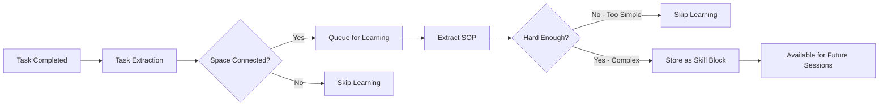

<div align="center">
  <a href="https://discord.acontext.io">
      
  </a>
  <p>
    <h3>컨텍스트 저장, 스킬 학습</h3>
  </p>
  <p align="center">
    <a href="https://pypi.org/project/acontext/"></a>
    <a href="https://www.npmjs.com/package/@acontext/acontext"></a>
    <a href="https://github.com/memodb-io/acontext/actions/workflows/core-test.yaml"></a>
    <a href="https://github.com/memodb-io/acontext/actions/workflows/api-test.yaml"></a>
    <a href="https://github.com/memodb-io/acontext/actions/workflows/cli-test.yaml"></a>
  </p>
  <p align="center">
    <a href="https://x.com/acontext_io"></a>
    <a href="https://discord.acontext.io"></a>
  </p>
  <div align="center">
    <!-- Keep these links. Translations will automatically update with the README. -->
    <a href="../../readme/de/README.md">Deutsch</a> | 
    <a href="../../readme/es/README.md">Español</a> | 
    <a href="../../readme/fr/README.md">Français</a> | 
    <a href="../../readme/ja/README.md">日本語</a> | 
    <a href="../../readme/ko/README.md">한국어</a> | 
    <a href="../../readme/pt/README.md">Português</a> | 
    <a href="../../readme/ru/README.md">Русский</a> | 
    <a href="../../readme/zh/README.md">中文</a>
  </div>
  <br/>
</div>


Acontext는 **클라우드 네이티브** AI Agent 애플리케이션을 위한 **컨텍스트 데이터 플랫폼**입니다. 다음을 수행할 수 있습니다:

- **저장** 컨텍스트 및 artifacts
- **관찰** Agent 작업 및 사용자 피드백.
- Agent의 완료된 작업에서 스킬을 추출하여 Agent **자기 학습**을 가능하게 합니다.
- 모든 컨텍스트를 하나의 **대시보드**에서 확인합니다.


<div align="center">
    <picture>
      
    </picture>
  <p>저장, 관찰 및 학습</p>
</div>


우리가 이를 구축하는 이유는 Acontext가 다음과 같은 도움을 줄 수 있다고 믿기 때문입니다:

- **더 나은 컨텍스트 엔지니어링으로 더 확장 가능한 Agent 제품 구축**
- **Agent 성공률 향상 및 실행 단계 감소**

이를 통해 Agent가 더 안정적이고 사용자에게 더 큰 가치를 제공할 수 있습니다.


# 💡 핵심 개념

- [**Session**](https://docs.acontext.io/store/messages/multi-provider) - Acontext에 컨텍스트를 저장할 수 있습니다. 데이터베이스와 같지만 컨텍스트 전용으로 사용됩니다.
  - [**Task Agent**](https://docs.acontext.io/observe/agent_tasks) - 작업의 상태, 진행 상황 및 선호도를 수집하는 백그라운드 TODO Agent.
- [**Disk**](https://docs.acontext.io/store/disk) - Agent Artifacts용 파일 저장소.
- [**Space**](https://docs.acontext.io/learn/skill-space) - 학습된 스킬이 저장되는 Notion과 유사한 Agents용 `Space`. 
  - [**Experience Agent**](https://docs.acontext.io/learn/advance/experience-agent) - 스킬을 추출, 저장 및 검색하는 백그라운드 Agents.

### 함께 작동하는 방식

```txt
┌──────┐    ┌────────────┐    ┌──────────────┐    ┌───────────────┐
│ User │◄──►│ Your Agent │◄──►│   Session    │    │ Artifact Disk │
└──────┘    └─────▲──────┘    └──────┬───────┘    └───────────────┘
                  │                  │
                  │         ┌────────▼────────┐
                  │         │ Observed Tasks  │
                  │         └────────┬────────┘
                  │                  │
                  │         ┌────────▼────────┐
                  │         │   Learn Skills  │ # or wait for user confirmation
                  │         └────────┬────────┘
                  │                  │
                  └──────────────────┘
                  스킬이 Agent를 안내
```


<details>
<summary>📖 Task Structure</summary>

```json
{
  "task_description": "Star https://github.com/memodb-io/Acontext",
  "progresses": [
    "I have navigated to Acontext repo",
    "Tried to Star but a pop-up required me to login",
    ...
  ],
  "user_preferences": [
    "user wants to use outlook email to login"
  ]
}
```
</details>


<details>
<summary>📖 Skill Structure</summary>


```json
{
    "use_when": "star a repo on github.com",
    "preferences": "use user's outlook account",
    "tool_sops": [
        {"tool_name": "goto", "action": "goto github.com"},
        {"tool_name": "click", "action": "find login button if any. login first"},
        ...
    ]
}
```

</details>


<details>
<summary>📖 Space Structure</summary>

```txt
/
└── github/ (folder)
    └── GTM (page)
        ├── find_trending_repos (sop)
        └── find_contributor_emails (sop)
    └── basic_ops (page)
        ├── create_repo (sop)
        └── delete_repo (sop)
    ...
```
</details>


# 🚀 Start the Backend Locally

빠른 개념 증명을 위해 `acontext-cli`가 있습니다. 먼저 터미널에서 다운로드하세요:

```bash
curl -fsSL https://install.acontext.io | sh
```

컴퓨터에서 Acontext 백엔드를 시작하려면 [docker](https://www.docker.com/get-started/)가 설치되어 있고 OpenAI API 키가 있어야 합니다:

```bash
mkdir acontext_server && cd acontext_server
acontext docker up
```

> [📖 로컬 설정](https://docs.acontext.io/local#start-acontext-server-locally) Acontext는 최소한 OpenAI API 키가 필요합니다. LLM 모델로 `gpt-5.1` 또는 `gpt-4.1`을 권장합니다

`acontext docker up`은 Acontext용 `.env` 및 `config.yaml`을 생성/사용하고 데이터를 유지하기 위한 `db` 폴더를 생성합니다.


완료되면 다음 엔드포인트에 액세스할 수 있습니다:

- Acontext API Base URL: http://localhost:8029/api/v1
- Acontext Dashboard: http://localhost:3000/


<div align="center">
    <picture>
      
    </picture>
  <p>성공률 및 기타 메트릭 대시보드</p>
</div>


# 🧐 Use Acontext to build Agent

`acontext`로 엔드투엔드 스크립트 다운로드:

**Python**

```bash
acontext create my-proj --template-path "python/openai-basic"
```

> Python의 더 많은 예제:
>
> - `python/openai-agent-basic`: openai agent sdk의 자기 학습 Agent.
> - `python/agno-basic`: agno framework의 자기 학습 Agent.
> - `python/openai-agent-artifacts`: Artifacts를 편집하고 다운로드할 수 있는 Agent.

**Typescript**

```bash
acontext create my-proj --template-path "typescript/openai-basic"
```

> Typescript의 더 많은 예제:
>
> - `typescript/vercel-ai-basic`: @vercel/ai-sdk의 자기 학습 Agent


더 많은 템플릿은 예제 저장소를 확인하세요: [Acontext-Examples](https://github.com/memodb-io/Acontext-Examples).


## SDK Walk-through

<details>
<summary>클릭하여 열기</summary>


Python [](https://pypi.org/project/acontext/) 및 Typescript [](https://www.npmjs.com/package/@acontext/acontext) SDK를 유지 관리합니다. 아래 코드 스니펫은 Python을 사용합니다.

## SDK 설치

```
pip install acontext # for Python
npm i @acontext/acontext # for Typescript
```


## 클라이언트 초기화

```python
from acontext import AcontextClient

client = AcontextClient(
    base_url="http://localhost:8029/api/v1",
    api_key="sk-ac-your-root-api-bearer-token"
)
client.ping()

# yes, the default api_key is sk-ac-your-root-api-bearer-token
```

> [📖 async client doc](https://docs.acontext.io/settings/core)


## 저장

Acontext는 Agent 세션 및 Artifacts를 관리할 수 있습니다.

### 메시지 저장 [📖](https://docs.acontext.io/api-reference/session/send-message-to-session)

Acontext는 메시지 데이터에 대한 영구 저장소를 제공합니다. `session.send_message`를 호출하면 Acontext는 메시지를 영구 저장하고 이 세션 모니터링을 시작합니다:

<details>
<summary>코드 스니펫</summary>

```python
session = client.sessions.create()

messages = [
    {"role": "user", "content": "I need to write a landing page of iPhone 15 pro max"},
    {
        "role": "assistant",
        "content": "Sure, my plan is below:\n1. Search for the latest news about iPhone 15 pro max\n2. Init Next.js project for the landing page\n3. Deploy the landing page to the website",
    }
]

# Save messages
for msg in messages:
    client.sessions.send_message(session_id=session.id, blob=msg, format="openai")
```

> [📖](https://docs.acontext.io/store/messages/multi-modal) 멀티 모달 메시지 저장 및 anthropic SDK도 지원합니다.


</details>

### 메시지 로드 [📖](https://docs.acontext.io/api-reference/session/get-messages-from-session)

`sessions.get_messages`를 사용하여 세션 메시지 가져오기

<details>
<summary>코드 스니펫</summary>

```python
r = client.sessions.get_messages(session.id)
new_msg = r.items

new_msg.append({"role": "user", "content": "How are you doing?"})
r = openai_client.chat.completions.create(model="gpt-4.1", messages=new_msg)
print(r.choices[0].message.content)
client.sessions.send_message(session_id=session.id, blob=r.choices[0].message)
```

</details>

<div align="center">
    <picture>
      
    </picture>
  <p>로컬 대시보드에서 세션을 볼 수 있습니다</p>
</div>


### Artifacts [📖](https://docs.acontext.io/store/disk)

파일 경로를 사용하여 Artifacts를 저장하고 읽기 위해 Agent용 디스크 생성:

<details>
<summary>코드 스니펫</summary>

```python
from acontext import FileUpload

disk = client.disks.create()

file = FileUpload(
    filename="todo.md",
    content=b"# Sprint Plan\n\n## Goals\n- Complete user authentication\n- Fix critical bugs"
)
artifact = client.disks.artifacts.upsert(
    disk.id,
    file=file,
    file_path="/todo/"
)


print(client.disks.artifacts.list(
    disk.id,
    path="/todo/"
))

result = client.disks.artifacts.get(
    disk.id,
    file_path="/todo/",
    filename="todo.md",
    with_public_url=True,
    with_content=True
)
print(f"✓ File content: {result.content.raw}")
print(f"✓ Download URL: {result.public_url}")        
```
</details>


<div align="center">
    <picture>
      
    </picture>
  <p>로컬 대시보드에서 Artifacts를 볼 수 있습니다</p>
</div>


## 관찰 [📖](https://docs.acontext.io/observe)

각 세션에 대해 Acontext는 **자동으로** 백그라운드 Agent를 시작하여 작업 진행 상황 및 사용자 피드백을 추적합니다. **백그라운드 TODO Agent와 같습니다**. Acontext는 이를 사용하여 일일 Agent 성공률을 관찰합니다.

SDK를 사용하여 Agent 세션의 현재 상태를 검색하여 축소 및 압축과 같은 컨텍스트 엔지니어링에 사용할 수 있습니다. 

<details>
<summary>전체 스크립트</summary>

```python
from acontext import AcontextClient

# Initialize client
client = AcontextClient(
    base_url="http://localhost:8029/api/v1", api_key="sk-ac-your-root-api-bearer-token"
)

# Create a project and session
session = client.sessions.create()

# Conversation messages
messages = [
    {"role": "user", "content": "I need to write a landing page of iPhone 15 pro max"},
    {
        "role": "assistant",
        "content": "Sure, my plan is below:\n1. Search for the latest news about iPhone 15 pro max\n2. Init Next.js project for the landing page\n3. Deploy the landing page to the website",
    },
    {
        "role": "user",
        "content": "That sounds good. Let's first collect the message and report to me before any landing page coding.",
    },
    {
        "role": "assistant",
        "content": "Sure, I will first collect the message then report to you before any landing page coding.",
      	"tool_calls": [
            {
                "id": "call_001",
                "type": "function",
                "function": {
                    "name": "search_news",
                    "arguments": "{\"query\": \"iPhone news\"}"
                }
            }
        ]
    },
]

# Send messages in a loop
for msg in messages:
    client.sessions.send_message(session_id=session.id, blob=msg, format="openai")

# Wait for task extraction to complete
client.sessions.flush(session.id)

# Display extracted tasks
tasks_response = client.sessions.get_tasks(session.id)
print(tasks_response)
for task in tasks_response.items:
    print(f"\nTask #{task.order}:")
    print(f"  ID: {task.id}")
    print(f"  Title: {task.data['task_description']}")
    print(f"  Status: {task.status}")

    # Show progress updates if available
    if "progresses" in task.data:
        print(f"  Progress updates: {len(task.data['progresses'])}")
        for progress in task.data["progresses"]:
            print(f"    - {progress}")

    # Show user preferences if available
    if "user_preferences" in task.data:
        print("  User preferences:")
        for pref in task.data["user_preferences"]:
            print(f"    - {pref}")

```
> `flush`는 블로킹 호출이며 작업 추출이 완료될 때까지 기다립니다.
> 프로덕션에서 호출할 필요가 없습니다. Acontext에는 작업 추출이 적시에 완료되도록 하는 버퍼 메커니즘이 있습니다.

</details>

작업 반환 예시:

```txt
Task #1:
  Title: Search for the latest news about iPhone 15 Pro Max and report findings to the user before any landing page coding.
  Status: success
  Progress updates: 2
    - I confirmed that the first step will be reporting before moving on to landing page development.
    - I have already collected all the iPhone 15 pro max info and reported to the user, waiting for approval for next step.
  User preferences:
    - user expects a report on latest news about iPhone 15 pro max before any coding work on the landing page.

Task #2:
  Title: Initialize a Next.js project for the iPhone 15 Pro Max landing page.
  Status: pending

Task #3:
  Title: Deploy the completed landing page to the website.
  Status: pending
```


대시보드에서 세션 작업 상태를 볼 수 있습니다:

<div align="center">
    <picture>
      
    </picture>
  <p>작업 데모</p>
</div>


## 자기 학습

Acontext는 많은 세션을 수집하고 특정 작업에 대해 도구를 호출하는 방법의 스킬(SOP)을 학습할 수 있습니다.

### `Space`에 스킬 학습 [📖](https://docs.acontext.io/learn/skill-space)

`Space`는 Notion과 유사한 시스템에서 스킬, 경험 및 기억을 저장할 수 있습니다. 학습 프로세스를 활성화하려면 먼저 세션을 `Space`에 연결해야 합니다:

```python
# Step 1: Create a Space for skill learning
space = client.spaces.create()
print(f"Created Space: {space.id}")

# Step 2: Create a session attached to the space
session = client.sessions.create(space_id=space.id)

# ... push the agent working context
```

학습은 백그라운드에서 발생하며 실시간이 아닙니다(약 10-30초 지연). 

Acontext가 백그라운드에서 수행할 작업:



최종적으로 도구 호출 패턴이 있는 SOP 블록이 `Space`에 저장됩니다. 대시보드에서 각 `Space`를 볼 수 있습니다:

<div align="center">
    <picture>
      
    </picture>
  <p>Space 데모</p>
</div>


### `Space`에서 스킬 검색 [📖](https://docs.acontext.io/learn/search-skills)

`Space`에서 스킬을 검색하고 다음 세션에서 사용하려면:

```python
result = client.spaces.experience_search(
    space_id=space.id,
    query="I need to implement authentication",
  	mode="fast"
)
```

Acontext는 검색을 위해 `fast` 및 `agentic` 모드를 지원합니다. 전자는 임베딩을 사용하여 스킬을 일치시킵니다. 후자는 Experience Agent를 사용하여 전체 `Space`를 탐색하고 필요한 모든 스킬을 다루려고 시도합니다.

반환값은 sop 블록 목록이며 다음과 같습니다:

```json
{
    "use_when": "star a github repo",
    "preferences": "use personal account. star but not fork",
    "tool_sops": [
        {"tool_name": "goto", "action": "goto the user given github repo url"},
        {"tool_name": "click", "action": "find login button if any, and start to login first"},
        ...
    ]
}
```

</details>


# 🔍 문서

Acontext가 무엇을 할 수 있는지 더 잘 이해하려면 [문서](https://docs.acontext.io/)를 확인하세요


# ❤️ 최신 정보 유지

Github에서 Acontext에 별표를 표시하여 지원하고 즉시 알림을 받으세요 


# 🤝 함께하기

지원 및 토론을 위해 커뮤니티에 가입하세요:

-   [Acontext Discord에서 빌더와 토론](https://discord.acontext.io) 👻 
-  [X에서 Acontext 팔로우](https://x.com/acontext_io) 𝕏 


# 🌟 기여

- 먼저 [roadmap.md](../../ROADMAP.md)를 확인하세요.
- [contributing.md](../../CONTRIBUTING.md)를 읽어보세요


# 📑 라이선스

이 프로젝트는 현재 [Apache License 2.0](LICENSE)에 따라 라이선스됩니다.


# 🥇 배지

 

```md
[](https://acontext.io)

[](https://acontext.io)
```

