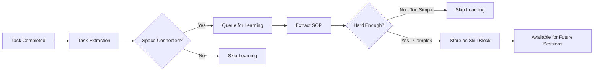

<div align="center">
  <a href="https://discord.acontext.io">
      
  </a>
  <p>
    <h3>Armazenar Contextos, Aprender Habilidades</h3>
  </p>
  <p align="center">
    <a href="https://pypi.org/project/acontext/"></a>
    <a href="https://www.npmjs.com/package/@acontext/acontext"></a>
    <a href="https://github.com/memodb-io/acontext/actions/workflows/core-test.yaml"></a>
    <a href="https://github.com/memodb-io/acontext/actions/workflows/api-test.yaml"></a>
    <a href="https://github.com/memodb-io/acontext/actions/workflows/cli-test.yaml"></a>
  </p>
  <p align="center">
    <a href="https://x.com/acontext_io"></a>
    <a href="https://discord.acontext.io"></a>
  </p>
  <div align="center">
    <!-- Keep these links. Translations will automatically update with the README. -->
    <a href="../../readme/de/README.md">Deutsch</a> | 
    <a href="../../readme/es/README.md">Español</a> | 
    <a href="../../readme/fr/README.md">Français</a> | 
    <a href="../../readme/ja/README.md">日本語</a> | 
    <a href="../../readme/ko/README.md">한국어</a> | 
    <a href="../../readme/pt/README.md">Português</a> | 
    <a href="../../readme/ru/README.md">Русский</a> | 
    <a href="../../readme/zh/README.md">中文</a>
  </div>
  <br/>
</div>


Acontext é uma **plataforma de dados de contexto** para aplicações de AI Agent **cloud-native**. Pode:

- **Armazenar** contextos e artifacts
- **Observar** tarefas de agentes e feedback do usuário.
- Habilitar o **autoaprendizado** de agentes através da destilação de habilidades das tarefas concluídas do agente.
- Visualizar cada contexto em um **Painel**.


<div align="center">
    <picture>
      
    </picture>
  <p>Armazenar, Observar e Aprender</p>
</div>


Estamos construindo isso porque acreditamos que o Acontext pode ajudá-lo a:

- **Construir um produto de agente mais escalável com melhor engenharia de contexto**
- **Melhorar sua taxa de sucesso do agente e reduzir etapas de execução**

para que seu agente possa ser mais estável e fornecer maior valor aos seus usuários.


# 💡 Conceitos Centrais

- [**Session**](https://docs.acontext.io/store/messages/multi-provider) - Você pode armazenar contexto no Acontext, como um banco de dados, mas usado apenas para contexto.
  - [**Task Agent**](https://docs.acontext.io/observe/agent_tasks) - Agente TODO em segundo plano que coleta status, progresso e preferências da tarefa.
- [**Disk**](https://docs.acontext.io/store/disk) - Armazenamento de arquivos para artifacts de agentes.
- [**Space**](https://docs.acontext.io/learn/skill-space) - Um `Space` semelhante ao Notion para agentes, onde habilidades aprendidas são armazenadas. 
  - [**Experience Agent**](https://docs.acontext.io/learn/advance/experience-agent) - Agentes em segundo plano que destilam, salvam e pesquisam habilidades.

### Como Eles Trabalham Juntos

```txt
┌──────┐    ┌────────────┐    ┌──────────────┐    ┌───────────────┐
│ User │◄──►│ Your Agent │◄──►│   Session    │    │ Artifact Disk │
└──────┘    └─────▲──────┘    └──────┬───────┘    └───────────────┘
                  │                  │
                  │         ┌────────▼────────┐
                  │         │ Observed Tasks  │
                  │         └────────┬────────┘
                  │                  │
                  │         ┌────────▼────────┐
                  │         │   Learn Skills  │ # or wait for user confirmation
                  │         └────────┬────────┘
                  │                  │
                  └──────────────────┘
                  Habilidades guiam o agente
```


<details>
<summary>📖 Task Structure</summary>

```json
{
  "task_description": "Star https://github.com/memodb-io/Acontext",
  "progresses": [
    "I have navigated to Acontext repo",
    "Tried to Star but a pop-up required me to login",
    ...
  ],
  "user_preferences": [
    "user wants to use outlook email to login"
  ]
}
```
</details>


<details>
<summary>📖 Skill Structure</summary>


```json
{
    "use_when": "star a repo on github.com",
    "preferences": "use user's outlook account",
    "tool_sops": [
        {"tool_name": "goto", "action": "goto github.com"},
        {"tool_name": "click", "action": "find login button if any. login first"},
        ...
    ]
}
```

</details>


<details>
<summary>📖 Space Structure</summary>

```txt
/
└── github/ (folder)
    └── GTM (page)
        ├── find_trending_repos (sop)
        └── find_contributor_emails (sop)
    └── basic_ops (page)
        ├── create_repo (sop)
        └── delete_repo (sop)
    ...
```
</details>


# 🚀 Start the Backend Locally

Temos um `acontext-cli` para ajudá-lo a fazer uma prova de conceito rápida. Baixe-o primeiro no seu terminal:

```bash
curl -fsSL https://install.acontext.io | sh
```

Você deve ter [docker](https://www.docker.com/get-started/) instalado e uma Chave API OpenAI para iniciar um backend Acontext no seu computador:

```bash
mkdir acontext_server && cd acontext_server
acontext docker up
```

> [📖 configuração local](https://docs.acontext.io/local#start-acontext-server-locally) Acontext requer pelo menos uma Chave API OpenAI. Recomendamos `gpt-5.1` ou `gpt-4.1` como modelo LLM

`acontext docker up` criará/usará `.env` e `config.yaml` para Acontext, e criará uma pasta `db` para persistir dados.


Quando terminar, você pode acessar os seguintes endpoints:

- Acontext API Base URL: http://localhost:8029/api/v1
- Acontext Dashboard: http://localhost:3000/


<div align="center">
    <picture>
      
    </picture>
  <p>Painel de Taxa de Sucesso e outras Métricas</p>
</div>


# 🧐 Use Acontext to build Agent

Baixe scripts de ponta a ponta com `acontext`:

**Python**

```bash
acontext create my-proj --template-path "python/openai-basic"
```

> Mais exemplos em Python:
>
> - `python/openai-agent-basic`: Agent de autoaprendizado no openai agent sdk.
> - `python/agno-basic`: Agent de autoaprendizado no agno framework.
> - `python/openai-agent-artifacts`: Agent que pode editar e baixar Artifacts.

**Typescript**

```bash
acontext create my-proj --template-path "typescript/openai-basic"
```

> Mais exemplos em Typescript:
>
> - `typescript/vercel-ai-basic`: Agent de autoaprendizado no @vercel/ai-sdk


Confira nosso repositório de exemplos para mais modelos: [Acontext-Examples](https://github.com/memodb-io/Acontext-Examples).


## SDK Walk-through

<details>
<summary>Clique para Abrir</summary>


Mantemos SDKs Python [](https://pypi.org/project/acontext/) e Typescript [](https://www.npmjs.com/package/@acontext/acontext). Os trechos de código abaixo usam Python.

## Instalar SDKs

```
pip install acontext # for Python
npm i @acontext/acontext # for Typescript
```


## Inicializar Cliente

```python
from acontext import AcontextClient

client = AcontextClient(
    base_url="http://localhost:8029/api/v1",
    api_key="sk-ac-your-root-api-bearer-token"
)
client.ping()

# yes, the default api_key is sk-ac-your-root-api-bearer-token
```

> [📖 async client doc](https://docs.acontext.io/settings/core)


## Armazenar

Acontext pode gerenciar sessões de Agents e Artifacts.

### Salvar Mensagens [📖](https://docs.acontext.io/api-reference/session/send-message-to-session)

Acontext oferece armazenamento persistente para dados de mensagens. Quando você chama `session.send_message`, o Acontext persistirá a mensagem e começará a monitorar esta sessão:

<details>
<summary>Trecho de Código</summary>

```python
session = client.sessions.create()

messages = [
    {"role": "user", "content": "I need to write a landing page of iPhone 15 pro max"},
    {
        "role": "assistant",
        "content": "Sure, my plan is below:\n1. Search for the latest news about iPhone 15 pro max\n2. Init Next.js project for the landing page\n3. Deploy the landing page to the website",
    }
]

# Save messages
for msg in messages:
    client.sessions.send_message(session_id=session.id, blob=msg, format="openai")
```

> [📖](https://docs.acontext.io/store/messages/multi-modal) Também suportamos armazenamento de mensagens multi-modal e SDK anthropic.


</details>

### Carregar Mensagens [📖](https://docs.acontext.io/api-reference/session/get-messages-from-session)

Obtenha as mensagens da sua sessão usando `sessions.get_messages`

<details>
<summary>Trecho de Código</summary>

```python
r = client.sessions.get_messages(session.id)
new_msg = r.items

new_msg.append({"role": "user", "content": "How are you doing?"})
r = openai_client.chat.completions.create(model="gpt-4.1", messages=new_msg)
print(r.choices[0].message.content)
client.sessions.send_message(session_id=session.id, blob=r.choices[0].message)
```

</details>

<div align="center">
    <picture>
      
    </picture>
  <p>Você pode visualizar sessões no seu Painel local</p>
</div>


### Artifacts [📖](https://docs.acontext.io/store/disk)

Crie um disco para seu Agent armazenar e ler Artifacts usando caminhos de arquivo:

<details>
<summary>Trecho de Código</summary>

```python
from acontext import FileUpload

disk = client.disks.create()

file = FileUpload(
    filename="todo.md",
    content=b"# Sprint Plan\n\n## Goals\n- Complete user authentication\n- Fix critical bugs"
)
artifact = client.disks.artifacts.upsert(
    disk.id,
    file=file,
    file_path="/todo/"
)


print(client.disks.artifacts.list(
    disk.id,
    path="/todo/"
))

result = client.disks.artifacts.get(
    disk.id,
    file_path="/todo/",
    filename="todo.md",
    with_public_url=True,
    with_content=True
)
print(f"✓ File content: {result.content.raw}")
print(f"✓ Download URL: {result.public_url}")        
```
</details>


<div align="center">
    <picture>
      
    </picture>
  <p>Você pode visualizar Artifacts no seu Painel local</p>
</div>


## Observar [📖](https://docs.acontext.io/observe)

Para cada sessão, o Acontext **automaticamente** iniciará um Agent em segundo plano para rastrear o progresso da tarefa e o feedback do usuário. **É como um Agent TODO em segundo plano**. Acontext o usará para observar sua taxa de sucesso diária do Agent.

Você pode usar o SDK para recuperar o estado atual da sessão do Agent, para Context Engineering como Redução e Compressão. 

<details>
<summary>Script Completo</summary>

```python
from acontext import AcontextClient

# Initialize client
client = AcontextClient(
    base_url="http://localhost:8029/api/v1", api_key="sk-ac-your-root-api-bearer-token"
)

# Create a project and session
session = client.sessions.create()

# Conversation messages
messages = [
    {"role": "user", "content": "I need to write a landing page of iPhone 15 pro max"},
    {
        "role": "assistant",
        "content": "Sure, my plan is below:\n1. Search for the latest news about iPhone 15 pro max\n2. Init Next.js project for the landing page\n3. Deploy the landing page to the website",
    },
    {
        "role": "user",
        "content": "That sounds good. Let's first collect the message and report to me before any landing page coding.",
    },
    {
        "role": "assistant",
        "content": "Sure, I will first collect the message then report to you before any landing page coding.",
      	"tool_calls": [
            {
                "id": "call_001",
                "type": "function",
                "function": {
                    "name": "search_news",
                    "arguments": "{\"query\": \"iPhone news\"}"
                }
            }
        ]
    },
]

# Send messages in a loop
for msg in messages:
    client.sessions.send_message(session_id=session.id, blob=msg, format="openai")

# Wait for task extraction to complete
client.sessions.flush(session.id)

# Display extracted tasks
tasks_response = client.sessions.get_tasks(session.id)
print(tasks_response)
for task in tasks_response.items:
    print(f"\nTask #{task.order}:")
    print(f"  ID: {task.id}")
    print(f"  Title: {task.data['task_description']}")
    print(f"  Status: {task.status}")

    # Show progress updates if available
    if "progresses" in task.data:
        print(f"  Progress updates: {len(task.data['progresses'])}")
        for progress in task.data["progresses"]:
            print(f"    - {progress}")

    # Show user preferences if available
    if "user_preferences" in task.data:
        print("  User preferences:")
        for pref in task.data["user_preferences"]:
            print(f"    - {pref}")

```
> `flush` é uma chamada bloqueante, aguardará a conclusão da extração da tarefa.
> Você não precisa chamá-lo em produção, o Acontext tem um mecanismo de buffer para garantir que a extração da tarefa seja concluída no momento certo.

</details>

Exemplo de Retorno de Tarefa:

```txt
Task #1:
  Title: Search for the latest news about iPhone 15 Pro Max and report findings to the user before any landing page coding.
  Status: success
  Progress updates: 2
    - I confirmed that the first step will be reporting before moving on to landing page development.
    - I have already collected all the iPhone 15 pro max info and reported to the user, waiting for approval for next step.
  User preferences:
    - user expects a report on latest news about iPhone 15 pro max before any coding work on the landing page.

Task #2:
  Title: Initialize a Next.js project for the iPhone 15 Pro Max landing page.
  Status: pending

Task #3:
  Title: Deploy the completed landing page to the website.
  Status: pending
```


Você pode visualizar os status das tarefas da sessão no Painel:

<div align="center">
    <picture>
      
    </picture>
  <p>Uma Demonstração de Tarefa</p>
</div>


## Autoaprendizado

Acontext pode coletar várias sessões e aprender habilidades (SOPs) sobre como chamar ferramentas para certas tarefas.

### Aprender Habilidades em um `Space` [📖](https://docs.acontext.io/learn/skill-space)

Um `Space` pode armazenar habilidades, experiências e memórias em um sistema semelhante ao Notion. Você primeiro precisa conectar uma sessão ao `Space` para habilitar o processo de aprendizado:

```python
# Step 1: Create a Space for skill learning
space = client.spaces.create()
print(f"Created Space: {space.id}")

# Step 2: Create a session attached to the space
session = client.sessions.create(space_id=space.id)

# ... push the agent working context
```

O aprendizado acontece em segundo plano e não é em tempo real (atraso de cerca de 10-30 segundos). 

O que o Acontext fará em segundo plano:



Por fim, blocos SOP com padrão de chamada de ferramenta serão salvos no `Space`. Você pode visualizar cada `Space` no Painel:

<div align="center">
    <picture>
      
    </picture>
  <p>Uma Demonstração de Space</p>
</div>


### Pesquisar Habilidades de um `Space` [📖](https://docs.acontext.io/learn/search-skills)

Para pesquisar habilidades de um `Space` e usá-las na próxima sessão:

```python
result = client.spaces.experience_search(
    space_id=space.id,
    query="I need to implement authentication",
  	mode="fast"
)
```

Acontext suporta modos `fast` e `agentic` para pesquisa. O primeiro usa embeddings para corresponder habilidades. O segundo usa um Experience Agent para explorar todo o `Space` e tenta cobrir cada habilidade necessária.

O retorno é uma lista de blocos sop, que se parecem com isto:

```json
{
    "use_when": "star a github repo",
    "preferences": "use personal account. star but not fork",
    "tool_sops": [
        {"tool_name": "goto", "action": "goto the user given github repo url"},
        {"tool_name": "click", "action": "find login button if any, and start to login first"},
        ...
    ]
}
```

</details>


# 🔍 Documentação

Para entender melhor o que o Acontext pode fazer, por favor, consulte [nossa documentação](https://docs.acontext.io/)


# ❤️ Mantenha-se Atualizado

Marque o Acontext com uma estrela no Github para apoiar e receber notificações instantâneas 


# 🤝 Fiquem Juntos

Junte-se à comunidade para obter suporte e discussões:

-   [Discuta com Construtores no Acontext Discord](https://discord.acontext.io) 👻 
-  [Siga o Acontext no X](https://x.com/acontext_io) 𝕏 


# 🌟 Contribuindo

- Verifique primeiro nosso [roadmap.md](../../ROADMAP.md).
- Leia [contributing.md](../../CONTRIBUTING.md)


# 📑 LICENÇA

Este projeto está atualmente licenciado sob [Apache License 2.0](LICENSE).


# 🥇 Emblemas

 

```md
[](https://acontext.io)

[](https://acontext.io)
```

